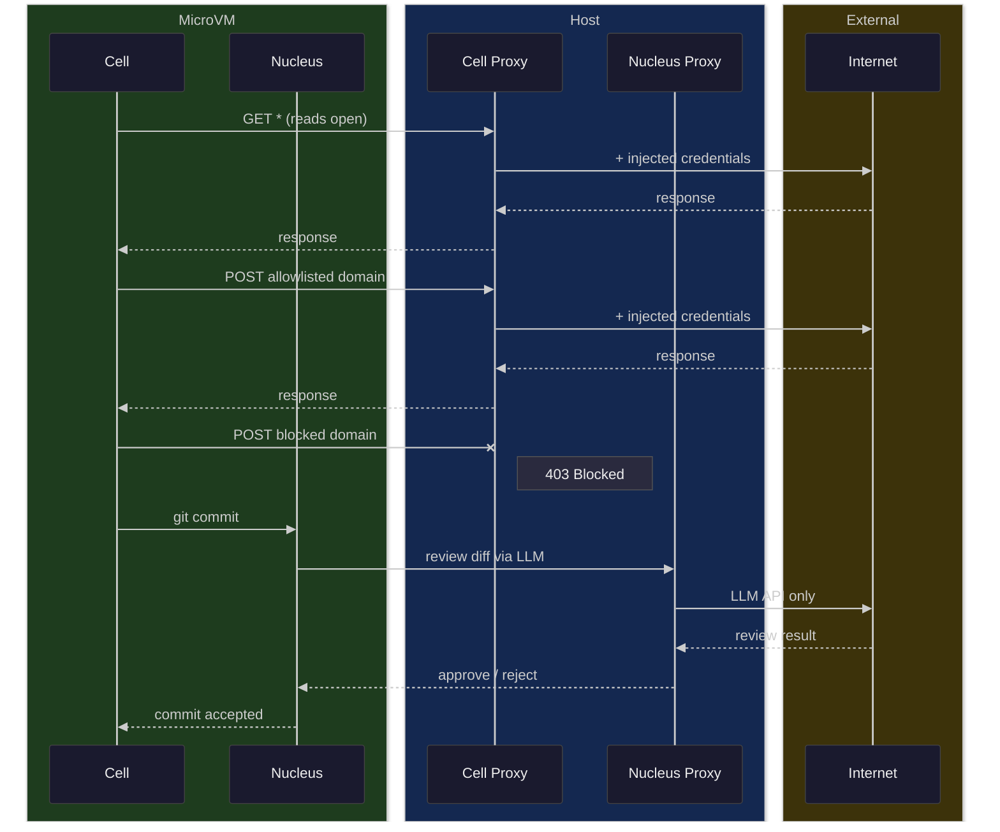

# cella

Clean sandboxing for autonomous agents. Git-native workflow, microVM-enforced
isolation, proxy-enforced network control. Runs on NixOS, deploys from any machine.

> [!WARNING]
> Cella is experimental. The security model is sound in design but the
> implementation is under active development and has not been audited.
> Do not rely on it for production security without independent review.

## Features

**Security:**

- **VM isolation** — each cell is a NixOS microVM; the host filesystem is untouched
- **Egress filtering** — reads are open, writes are allowlisted by domain and HTTP method
- **Secret injection** — API keys never enter the VM; the proxy injects credentials into outbound requests
- **Hardened review gate** — nucleus pre-commit hook reviews diffs via LLM on a separate, restricted proxy

**Workflow:**

- **Git-native** — push, pull, fetch, and merge between host and cells using standard git
- **Detachable sessions** — tmux-backed shell sessions persist across disconnects
- **Dev server tunneling** — `cella tunnel` forwards ports with per-cell DNS (`feat.myapp.cell`)
- **Lifecycle hooks** — run commands (e.g. `bun install`) automatically after code is pushed

**Operations:**

- **Dynamic cells** — each cell gets its own VM, IP, and DNS name on demand
- **Remote-transparent** — all commands work identically on local and remote hosts via SSH
- **Deploy from anywhere** — `cella deploy` provisions NixOS on any VPS
- **Composable VM config** — server-level and per-repo flakes with custom inputs are merged at cell creation

## Getting started

### Installation

Cella has two parts: a **client** CLI that runs on your machine, and a
**server** NixOS module that runs cells. You only need the client to work
with remote servers.

#### Client

Install on any machine — macOS, Linux, Windows, NixOS or not.

```bash
# binary (macOS, Linux)
curl -fsSL https://github.com/ixxie/cella/releases/latest/download/install.sh | sh

# nix (any OS with nix installed)
nix profile install github:ixxie/cella
```

The optional NixOS client module sets up the server registry, tunnel
support, and passwordless sudo for tunnel operations:

```nix
cella.client = {
  enable = true;
  user = "me";
  vmConfig = ./vm;                          # cell base config for localhost
  servers.prod = "root@1.2.3.4";            # server registry
};
```

Non-NixOS users can manage the server registry via CLI:

```bash
cella server add prod root@1.2.3.4
cella server list
```

#### Server

NixOS module that runs microVMs, the proxy, and network isolation.
Use it anywhere you manage NixOS — dotfiles, colmena, deploy-rs, or
standalone server repos.

```nix
{
  inputs.cella.url = "github:ixxie/cella";

  outputs = { nixpkgs, cella, ... }: {
    nixosConfigurations.myhost = nixpkgs.lib.nixosSystem {
      modules = [
        cella.nixosModules.server
        {
          cella.server.enable = true;
          environment.systemPackages = [
            cella.packages.x86_64-linux.default
          ];
        }
      ];
    };
  };
}
```

`cella deploy` is an optional convenience for deploying standalone server
repos — see [Deployment](#deployment).

### Configuration

Per-repo config lives in `.cella/config.toml`:

```toml
ports = [5173, 8001]
post_push = "bun install"
shell_timeout = 600

[session]
hooks = [".cella/hooks/rate-limit.sh"]

[nucleus]
command = "claude --print -s 'Review this diff for security issues'"
```

#### VM configuration

Guest VM customization uses flakes that export a `nixosModule`. This lets
you bring in arbitrary flake inputs (e.g. claude-code, custom tools).

**Server-level** — a `vm/` directory alongside the server config, deployed
to `/var/lib/cella/vm-config/`. For localhost, set `vmConfig` in the client
module. For remote servers, `cella deploy` copies it automatically.

`vm/flake.nix`:

```nix
{
  inputs.claude-code.url = "github:anthropics/claude-code";

  outputs = { claude-code, ... }: {
    nixosModule = { pkgs, ... }: {
      environment.systemPackages = [
        pkgs.helix
        claude-code.packages.${pkgs.stdenv.hostPlatform.system}.default
      ];
    };
  };
}
```

**Per-repo** (`.cella/flake.nix`) — applies to cells for that repo:

```nix
{
  inputs.some-tool.url = "github:foo/bar";

  outputs = { some-tool, ... }: {
    nixosModule = { pkgs, ... }: {
      environment.systemPackages = [
        some-tool.packages.${pkgs.stdenv.hostPlatform.system}.default
      ];
    };
  };
}
```

Both are optional and merged at cell creation time.

### Secrets

Cella manages secrets so they never enter the VM. Two methods:

**Built-in age encryption** (default) — encrypt secrets into your repo:

```bash
echo "ANTHROPIC_API_KEY=sk-..." > .cella/secrets.env
cella secrets encrypt -r "ssh-ed25519 AAAA..."
cella secrets edit -r "ssh-ed25519 AAAA..."
```

The encrypted `.cella/secrets.age` is committed to the repo.
The plaintext `.cella/secrets.env` is gitignored. At boot, cella
decrypts using the host's SSH key and feeds secrets to the proxy.

**Custom command** — use any secret manager:

```toml
[secrets]
command = "sops -d .cella/secrets.yaml"
```

The command must output `KEY=VALUE` lines to stdout.

Host-level NixOS module config:

```nix
cella.server = {
  enable = true;
  nat.interface = "wlp1s0";

  egress = {
    writes.allowed = [
      "api.anthropic.com"
      "*.anthropic.com"
    ];
    credentials = [{
      host = "api.anthropic.com";
      header = "x-api-key";
      envVar = "ANTHROPIC_API_KEY";
    }];
  };

  credentialsFile = "/run/secrets/cella-env";
  nucleus.enable = true;

  vm.mounts = {
    "/home/me/.ssh" = { mountPoint = "/home/me/.ssh"; readOnly = true; };
  };
};
```

### Deployment

#### Remote

Deploy a standalone server repo to any VPS:

```bash
cd ~/repos/servers/prod
cella deploy
```

Reads the target from the server registry, config from the current directory.
Auto-detects the target OS:

- **Already NixOS** — updates in place via `nixos-rebuild`
- **Not NixOS** — bootstraps via nixos-anywhere (uses docker/podman if nix isn't installed locally)

If a `vm/` directory exists alongside the server config, it's deployed
to `/var/lib/cella/vm-config/` on the remote.

#### Local

On a NixOS machine, import the cella modules in your system flake
and run cells locally:

```bash
cella init                        # scaffold .cella/
cella server use localhost        # use local server
cella shell feat                  # creates branch, boots VM, attaches
```

## Usage

All commands run from inside a git repo. Each cell is a branch that gets
its own isolated VM with the repo mounted at `/<repo-name>`.

```bash
cella shell feat              # create branch + boot + attach (the one verb)
cella shell feat -c "make"    # run a command non-interactively
cella shell feat -s work      # named session (reattachable)
# Ctrl+] to detach            # session persists via tmux
# Ctrl+c to exit              # session is destroyed

cella kill feat               # force stop VM
cella kill feat -d            # force stop + delete branch and clone
cella list                    # list cells, sessions, autostop countdown
```

Cells auto-stop when all tmux sessions are closed. The timeout is
configurable via `shell_timeout` in `.cella/config.toml` (default 300s).

Interact with agent work from the host through standard git:

```bash
git fetch cella               # fetch agent's commits
git diff cella/feat           # review changes
git pull cella feat           # merge into current branch
```

### Dev servers

Tunnel ports to localhost with per-cell DNS names:

```bash
cella tunnel feat -p 5173                # single port
cella tunnel feat -p 5173 -p 8001-8004   # multiple ports and ranges
cella tunnel feat -p 5173 -o             # open in browser
```

Each cell gets a unique loopback IP, so `http://feat.myapp.cell:5173` won't
conflict with a local dev server on the same port. The tunnel auto-reconnects
if the connection drops.

Ports can also be declared in config (used when no `-p` flags are given):

```toml
ports = [5173, 8001]
```

### Lifecycle hooks

`post_push` runs inside the VM after code is pushed:

```toml
post_push = "bun install"
```

### Session hooks

Long-running scripts that monitor tmux sessions. Each hook gets a
`session` command on PATH with `read` and `send` subcommands:

```toml
[session]
command = "claude --dangerously-skip-permissions -p 'Build the project'"
on_exit = "scripts/cleanup.sh"
hooks = [".cella/hooks/rate-limit.sh"]
```

- `command` — replaces the default shell (for headless agent sessions)
- `on_exit` — runs when the session ends
- `hooks` — background scripts started with each session

Example hook (`.cella/hooks/rate-limit.sh`):

```bash
#!/bin/sh
while true; do
  content=$(session read)
  if echo "$content" | grep -q "limit reached"; then
    # parse reset time, wait, then continue
    sleep 300
    session send "continue"
  fi
  sleep 10
done
```

### Logs

```bash
cella logs              # tail client log
cella logs -f           # follow
cella logs --server     # tail server log (via SSH)
```

### Servers

Manage the server registry:

```bash
cella server add prod root@1.2.3.4     # register a server
cella server remove prod                # unregister
cella server list                       # show all servers
cella server use prod                   # set active server for this repo
```

NixOS users can declare servers in the client module instead.

## Anatomy

The **proxy** is the core security boundary. It sits between the cell and
the internet, injecting credentials into outbound requests and filtering
egress by HTTP method and domain. Secrets never enter the VM.

The **nucleus** is an independent review layer. When the agent commits code,
a pre-commit hook sends the diff to an LLM running through a separate proxy
that can only reach the LLM API — no web access, no injection surface.



## Threat model

Fully autonomous agents that possess the [lethal trifecta](https://simonwillison.net/2025/Jun/16/the-lethal-trifecta/)
— access to private data, exposure to untrusted content, and the ability to
communicate externally — pose a serious security risk. Any two of these are
manageable; all three enable exfiltration. Cella ensures the three never
coexist inside a cell.

Beyond exfiltration, agents pose additional risks to the host system and
codebase integrity that cella addresses independently.

### Secret exfiltration

**Threat:** A prompt injection hidden in web content, documentation, or
dependency metadata instructs the agent to read API keys from its
environment and send them to an attacker-controlled endpoint.

**Defense:** Secrets never enter the cell. The proxy intercepts outbound
requests and injects credentials (API keys, tokens) into the appropriate
headers on the fly. Inside the VM, there are no environment variables,
files, or config containing secrets. Even if the agent is fully compromised
by a prompt injection, there is nothing to exfiltrate.

Write access is further restricted by an egress allowlist. The agent can
only POST/PUT/PATCH/DELETE to domains you explicitly permit. An injected
prompt cannot phone home because the proxy blocks the request. Reads
(GET/HEAD/OPTIONS) are unrestricted — prompt injection via content is
harmless when there are no secrets to steal and no channel to exfiltrate
through.

### Filesystem damage

**Threat:** The agent modifies host files, installs persistent malware,
corrupts system state, or alters other projects on the machine.

**Defense:** Each cell is a NixOS microVM with its own isolated filesystem.
The repository is mounted via VirtioFS — the agent can modify the repo
contents but has no access to the host filesystem. The nix store is shared
read-only for performance. There is no sudo, no root access, and `/tmp`
is capped at 1GB. If a cell is compromised, `cella delete` wipes it completely.

### Backdoor injection

**Threat:** The agent commits malicious code — a backdoor, a dependency
substitution, or a subtle logic change — that slips through human review.

**Defense:** The nucleus is a pre-commit hook that intercepts every
`git commit` inside the cell. It sends the diff to an LLM reviewer running
through a separate proxy that can *only* reach the LLM API. The reviewer
has no web access, no ability to be prompt-injected via external content,
and no access to the cell's network. It evaluates the diff in isolation
and can reject the commit before it's recorded.

The nucleus proxy is intentionally more restricted than the cell proxy —
it allows a single API endpoint and nothing else. This separation ensures
the reviewer cannot be influenced by the same content that may have
compromised the agent.

## NixOS module effects

Both modules are opt-in (`enable = true`) and only modify the system when
explicitly enabled. This section documents every system-level change so you
can audit before importing.

### Server module (`cella.nixosModules.server`)

The server module runs on the machine that hosts cell VMs. It creates:

**Network:**
- A bridge interface (`cellabr` on `192.168.83.0/24`) for VM networking
- systemd-networkd config to attach VM tap devices to the bridge
- NAT masquerading for proxy outbound traffic
- `net.ipv4.ip_forward = 1`

**Firewall (nftables):**
- Forward chain with default-drop policy — cells can only reach:
  - The HTTP proxy (port 8080)
  - The git credential service (port 8081)
  - The nucleus proxy (port 8083, if enabled)
  - Host SSH (port 22)
- All other outbound traffic from cells is blocked
- The bridge interface is added to `trustedInterfaces`

**DNS:**
- dnsmasq on the bridge interface (`192.168.83.1`) serving `.cell` hostnames
- Reads from `/var/lib/cella/dns-hosts` (dynamically updated as cells start/stop)
- Only listens on the bridge — does not affect host DNS resolution

**Services:**
- `cella-mitmproxy` — MITM proxy for egress filtering and credential injection
- `cella-ca-sync` — extracts the mitmproxy CA public cert for guest trust
- `cella-nucleus-proxy` — restricted proxy for nucleus LLM review (if enabled)
- `cella-services` — control API for cell lifecycle (boot, stop, list)
- `cella-sweep` — timer that runs every 60s to auto-stop idle cells
- `cella-hostkey` — generates SSH keypair for server-side VM access (sweep, session counting)

**Proxy:**
- `egress.passthrough` domains bypass TLS interception (for OAuth flows)
- Traffic to passthrough domains is forwarded without MITM — real TLS end-to-end

**Filesystem:**
- `/var/lib/cella/` — cells, IP pool, DNS hosts, CA certs, proxy config, SSH keys
- `/var/log/cella/` — proxy and cella service logs
- `/etc/cella/host-config.json` — host configuration read by cell VMs
- `/etc/cella/proxy-config.json` — proxy configuration

**Other:**
- `programs.git` enabled with `safe.directory = *` (for cell repo access)
- Sudo rules for `systemctl start/stop microvm@*`
- microvm.nix host module (imported transitively)

### Client module (`cella.nixosModules.client`)

The client module is optional and runs on developer machines. It provides
convenience features that can also be set up manually.

**`/etc/hosts`:**
- Sets `environment.etc.hosts.mode = "0644"` so `/etc/hosts` is a writable
  copy instead of a read-only nix store symlink. This lets `cella tunnel`
  add `.cell` hostname entries at runtime. Entries are tagged with
  `# cella-tunnel` and cleaned up when the tunnel closes. A `nixos-rebuild`
  resets `/etc/hosts` to the declared state.

**Server registry:**
- Writes `~/.config/cella/servers.toml` from the `servers` option via an
  activation script

**VM config (localhost):**
- If `vmConfig` is set, copies the directory to `/var/lib/cella/vm-config/`
  for use by locally-running cells

**Client config:**
- Writes `~/.config/cella/config.toml` from the `sync` option
- `sync` lists files to copy into remote cells on entry (e.g. `~/.claude.json`)

**Sudo rules (passwordless):**
- `ip addr add/del 127.*/8 dev lo` — loopback aliases for tunnel port binding
- `cella hosts add/remove` — scoped `/etc/hosts` manipulation (only touches
  lines tagged `# cella-tunnel`)

**Tmpfiles:**
- `/run/cella/` directory (runtime state)

The client module does **not** install dnsmasq, modify DNS resolution, or
change NetworkManager/systemd-resolved configuration.
