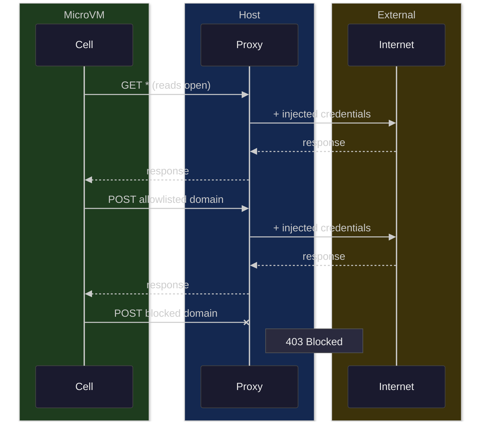

# cella

Clean sandboxing for autonomous agents. Git-native workflow, microVM-enforced
isolation, proxy-enforced network control. Runs on NixOS, deploys from any machine.

> [!WARNING]
> Cella is experimental. The security model is sound in design but the
> implementation is under active development and has not been audited.
> Do not rely on it for production security without independent review.

## Features

**Security:**

- **VM isolation** — each cell is a NixOS microVM; the host filesystem is untouched
- **Egress filtering** — reads are open, writes are allowlisted by domain and HTTP method
- **Secret injection** — API keys never enter the VM; the proxy injects credentials into outbound requests
- **Per-repo egress** — each repo declares its own network rules and credentials

**Workflow:**

- **Git-native** — push, pull, fetch, and merge between host and cells using standard git
- **Flow engine** — middleware hook system (pre/handle/post) with agent-driven transitions
- **Transition params** — ops pass structured data through the flow via `$OP_PARAMS`
- **In-VM services** — `cellx service` manages background processes (dev servers) across ops
- **Dev server tunneling** — `cella tunnel` forwards ports with per-cell DNS (`feat.myapp.cell`)

**Operations:**

- **Dynamic cells** — each cell gets its own VM, IP, and DNS name on demand
- **Branch-centric** — `cella create` sets up branch + worktree + cell; context is implicit from cwd
- **Remote-transparent** — all commands work identically on local and remote hosts via SSH
- **Deploy from anywhere** — `cella deploy` provisions NixOS on any VPS
- **Composable VM config** — server-level and per-repo flakes with custom inputs are merged at cell creation
- **TTL + GC** — op timeouts, server-side sweep for stale cells, manual or automated garbage collection
- **Default server** — configurable at client or repo level, no `-s` flag needed

## Getting started

### Installation

Cella has two parts: a **client** CLI that runs on your machine, and a
**server** NixOS module that runs cells. You only need the client to work
with remote servers.

#### Client

Install on any machine — macOS, Linux, Windows, NixOS or not.

```bash
# binary (macOS, Linux)
curl -fsSL https://github.com/ixxie/cella/releases/latest/download/install.sh | sh

# nix (any OS with nix installed)
nix profile install github:ixxie/cella
```

The optional NixOS client module sets up the server registry, tunnel
support, and passwordless sudo for tunnel operations:

```nix
cella.client = {
  enable = true;
  user = "me";
  server = "prod";                             # default server for all repos
  vmConfig = ./vm;                             # cell base config for localhost
  servers.prod = "root@1.2.3.4";               # server registry
  sync = ["~/.claude.json"];                   # files synced into remote cells
};
```

Non-NixOS users can manage the server registry via CLI:

```bash
cella server add prod root@1.2.3.4
cella server list
```

#### Server

NixOS module that runs microVMs, the proxy, and network isolation.
Use it anywhere you manage NixOS — dotfiles, colmena, deploy-rs, or
standalone server repos.

```nix
{
  inputs.cella.url = "github:ixxie/cella";

  outputs = { nixpkgs, cella, ... }: {
    nixosConfigurations.myhost = nixpkgs.lib.nixosSystem {
      modules = [
        cella.nixosModules.server
        {
          cella.server.enable = true;
          environment.systemPackages = [
            cella.packages.x86_64-linux.default
          ];
        }
      ];
    };
  };
}
```

For standalone server repos, `cella.lib.mkHost` provides a minimal wrapper:

```nix
cella.lib.mkHost { inherit cella nixpkgs disko; } {
  name = "myhost";
  disk = ./disk.nix;
  sshPubkey = "ssh-ed25519 AAAA...";
}
```

### Configuration

Per-repo config lives in `.cella/config.toml`:

```toml
memory = "4096M"
vcpu = 2
server = "prod"                   # default server (overrides client default)
ports = [5173]
post_push = "bun install"

[secrets]
recipient = "ssh-ed25519 AAAA..."

[egress]
writes.allowed = ["opencode.ai", "api.linear.app"]

[[egress.credentials]]
host = "opencode.ai"
header = "Authorization"
env_var = "OPENCODE_API_KEY"

[[egress.credentials]]
host = "api.linear.app"
header = "Authorization"
env_var = "LINEAR_API_KEY"
```

Server resolution order: CLI `-s` flag > repo `server` > client `server` > scan running cells > localhost.

#### VM configuration

Guest VM customization uses flakes that export a `nixosModule`. This lets
you bring in arbitrary flake inputs (e.g. opencode, custom tools).

**Server-level** — a `vm/` directory alongside the server config, deployed
to `/var/lib/cella/vm-config/`. For localhost, set `vmConfig` in the client
module.

**Per-repo** (`.cella/flake.nix`) — applies to cells for that repo:

```nix
{
  inputs.opencode.url = "github:anomalyco/opencode/dev";

  outputs = { opencode, ... }: {
    nixosModule = { pkgs, ... }: {
      environment.systemPackages = [
        opencode.packages.${pkgs.stdenv.hostPlatform.system}.default
      ];
    };
  };
}
```

Both are optional and merged at cell creation time.

### Secrets

Cella manages secrets so they never enter the VM. The proxy reads
`/var/lib/cella/secrets.env` and injects credentials into outbound
requests based on the egress credential rules.

**Built-in age encryption** (default) — encrypt secrets into your repo:

```bash
cella secrets edit                  # decrypt, edit, re-encrypt
cella secrets encrypt               # encrypt .cella/secrets.env
```

Set the recipient once in `.cella/config.toml`:

```toml
[secrets]
recipient = "ssh-ed25519 AAAA..."
```

The encrypted `.cella/secrets.age` is committed to the repo.
The plaintext `.cella/secrets.env` is gitignored. At boot, cella
decrypts using the host's SSH key and feeds secrets to the proxy.

**Custom command** — use any secret manager:

```toml
[secrets]
command = "sops -d .cella/secrets.yaml"
```

The command must output `KEY=VALUE` lines to stdout.

#### Credential injection

Credentials are injected per-host at the proxy level. Configure them
at the repo level in `.cella/config.toml`:

```toml
[[egress.credentials]]
host = "api.anthropic.com"
header = "x-api-key"
env_var = "ANTHROPIC_API_KEY"
```

Or at the server level in the NixOS config:

```nix
cella.server.egress.credentials = [{
  host = "api.anthropic.com";
  header = "x-api-key";
  envVar = "ANTHROPIC_API_KEY";
}];
```

Repo-level credentials are merged with server-level ones. The proxy
reads the env var from `secrets.env` (or the process environment) and
injects it as the specified header on matching requests.

### Deployment

#### Remote

Deploy a standalone server repo to any VPS:

```bash
cd ~/repos/servers/prod
cella server deploy
```

Auto-detects the target OS:

- **Already NixOS** — updates in place via `nixos-rebuild`
- **Not NixOS** — bootstraps via nixos-anywhere

#### Local

On a NixOS machine, import the cella modules in your system flake
and run cells locally.

### Garbage collection

Stopped cells accumulate on the server. Clean them up manually or on a timer.

```bash
cella server gc                    # delete cells stopped > 7 days
cella server gc --older-than 24h   # custom threshold
cella server gc --dry-run          # preview what would be deleted
```

Enable automated GC in the server NixOS config:

```nix
cella.server.gc = {
  enable = true;
  interval = "daily";     # systemd calendar expression
  olderThan = "7d";       # delete cells stopped longer than this
};
```

The server also runs a **sweep** that stops VMs where the current op
has exceeded a timeout (default 6h). This catches crashed clients:

```nix
cella.server.sweep = {
  timeout = 21600;        # seconds (default: 6h)
  interval = 300;         # check every 5 minutes
};
```

## Usage

All commands run from inside a git repo. Each cell is a branch with
its own isolated VM, local worktree, and the repo mounted at `/<repo-name>`.

### Branch lifecycle

```bash
cella create feat                  # new branch + worktree + cell
cella add feat                     # adopt existing branch into cella
cella remove feat                  # tear down worktree + cell
cella remove feat -d               # also delete the git branch
cella list                         # list cella-managed branches
cella path feat                    # print worktree path
```

### Running flows

From inside a worktree (`.cella/trees/feat/`), the branch is implicit:

```bash
cella run dev                      # start flow (attached by default)
cella run dev -d                   # detach from output
cella run dev -- project="my app"  # pass params to the start op
cella logs -f                      # follow flow output
cella status                       # show flow state
cella pause                        # pause flow, cell stays up
cella stop                         # stop flow + cell
cella shell                        # SSH into the cell
cella shell -c "make"              # run a command non-interactively
```

Or specify the branch explicitly from anywhere:

```bash
cella run dev -b feat -- project="my app"
cella logs feat -f
cella shell feat
cella stop feat
```

### Git interaction

Interact with agent work from the host through standard git:

```bash
git fetch cella                    # fetch agent's commits
git diff cella/feat                # review changes
git pull cella feat                # merge into current branch
```

### Dev servers

Tunnel ports to localhost with per-cell DNS names:

```bash
cella tunnel feat -p 5173                # single port
cella tunnel feat -p 5173 -p 8001-8004   # multiple ports and ranges
cella tunnel feat -p 5173 -o             # open in browser
```

### Flow engine

The flow engine runs a middleware hook system inside the VM. Define ops
with prompts and hook scripts that control transitions.

```
.cella/flows/dev/
  flow.toml           # start op, rules, max_retries
  handle.sh           # flow-level handle (the harness — e.g. opencode)
  pre.sh              # flow-level pre hook (optional)
  ops/
    implement/
      op.md            # YAML frontmatter + prompt body
      post.sh          # transition logic
    validate/
      op.md
      handle.sh        # op-level override (e.g. run tests instead of agent)
      post.sh
```

#### flow.toml

```toml
[flow]
start = "dispatch"
max_retries = 10
timeout = "2h"          # default op timeout (ops can override)

[rules.no-test-write]
files.denied = ["tests/**"]
```

#### op.md

YAML frontmatter + markdown prompt body:

```yaml
---
name: implement
next:
  - implement
  - validate
params:
  model: opencode/claude-sonnet-4-6
---

Implement the current task. The task details are in $OP_PARAMS.
Run `bun run check` to verify the code compiles.
```

Frontmatter fields:

| Field | Purpose |
|---|---|
| `name` | Op identifier |
| `next` | Valid transitions (enforced) |
| `rules` | Rule names to activate |
| `on` | Lifecycle hook: `success`, `failure`, `finish` |
| `params` | Key-value pairs → `PARAM_*` env vars |
| `timeout` | Op-level timeout override (e.g. `4h`, `30m`) |

#### Hooks (middleware model)

Each op runs through a middleware onion:

```
flow/pre.sh → op/pre.sh → handle.sh → op/post.sh → flow/post.sh
```

- **pre** — setup (compose: both flow and op level run)
- **handle** — execute the work (override: op replaces flow)
- **post** — decide transition (compose: both run)

Resolution:

| Hook | Resolution | Required |
|---|---|---|
| `pre.sh` | op ?? flow ?? noop | No |
| `handle.sh` | op ?? flow | Yes (flow-level) |
| `post.sh` | op ?? flow ?? noop | No |

Hooks use shebangs for interpreter choice — no `command` field needed:

```sh
#!/usr/bin/env python3
# this handle.sh runs python
```

#### Environment variables

Hooks receive context via env vars:

| Variable | Scope | Description |
|---|---|---|
| `FLOW_NAME` | flow | Flow name |
| `FLOW_DIR` | flow | Flow directory path |
| `FLOW_STATE_DIR` | flow | Flow run state directory |
| `OP_NAME` | op | Current op name |
| `OP_WORKSPACE` | op | Per-invocation workspace directory |
| `OP_PROMPT` | op | Op body from op.md |
| `OP_PARAMS` | op | JSON params from transition |
| `OP_EXIT_CODE` | post | Handle exit code (post hooks only) |
| `OP_DURATION` | op | Elapsed seconds |
| `PARAM_*` | op | From op.md frontmatter params |

#### Transitions

Post hooks call `cellx flow` to decide what happens next:

```sh
#!/bin/sh
if [ "$OP_EXIT_CODE" -eq 0 ]; then
  cellx flow to validate --params '{"scenario": "SC-1"}'
else
  cellx flow retry
fi
```

| Command | Effect |
|---|---|
| `cellx flow to <op> [--params JSON]` | Transition (must be in `next` list) |
| `cellx flow retry [--after 30m]` | Rerun current op |
| `cellx flow pause` | Pause flow (cell stays up) |
| `cellx flow done` | End the flow |

If no decision is made (no `result.json` in workspace), the flow fails.
Retries are capped by `max_retries` (default: 10). Ops that exceed their
timeout (op-level > flow-level `timeout` > default 2h) fail the flow.

#### Per-op workspace

Each op invocation gets its own workspace directory:

```
/var/lib/cellx/state/
  {flow}-{timestamp}/
    flow.json
    {op}-{timestamp}/
      result.json
      (any artifacts hooks write)
```

The workspace path is in `$OP_WORKSPACE`. Workspaces persist for
debugging and audit. Each retry creates a new workspace.

#### Lifecycle ops

Ops with `on:` run after the main loop exits:

```yaml
---
name: preview
on: success
---

cellx service start preview 'bun run dev --host 0.0.0.0'
```

| `on` value | When it runs |
|---|---|
| `success` | Flow completed via `done` |
| `failure` | Flow exited with an error |
| `finish` | Always |

#### In-VM services

```bash
cellx service start <name> <cmd>   # start background process
cellx service stop <name>          # stop
cellx service restart <name>       # restart (reuses previous cmd)
cellx service logs <name> [-f]     # view logs
cellx service list                 # show running services
```

#### Rules

Rules control what the agent can access during each op.

**Server** — the NixOS egress config is `server:default`:

```nix
cella.server.egress = {
  reads.allowed = "*";
  writes.allowed = ["github.com" "*.github.com"];
  writes.denied = "*";
};
```

**Cell** — `.cella/config.toml`:

```toml
[egress]
writes.allowed = ["opencode.ai", "api.linear.app"]
```

**Flow** — `flow.toml`:

```toml
[rules.llm-only]
writes.allowed = ["api.anthropic.com"]
writes.denied = ["*"]
```

Rules compose via `extends` and field-level references. See the
rule composition table below.

| Pattern | Meaning |
|---|---|
| `extends = ["server:default"]` | Start from server baseline |
| `writes.denied = ["cell:strict", "*.evil.com"]` | Merge entries from another rule + literals |
| Op with `rules` omitted | Inherits `server:default` |
| Op with `rules = []` | No restrictions |

#### Example: dev flow

A complete development flow that reads tasks from Linear, implements
them with an AI agent, validates with tests, and fixes failures:

```
.cella/flows/dev/
  flow.toml
  handle.sh               # opencode harness
  pre.sh                  # bun install
  ops/
    dispatch/              # query Linear, pick next scenario
      op.md
      post.sh              # → implement or done
    implement/             # agent codes the task
      op.md
      post.sh              # → implement (next issue) or validate
    validate/              # build + playwright
      op.md
      handle.sh            # override: run tests, not agent
      post.sh              # → dispatch (pass) or fix (fail)
    fix/                   # agent fixes failures
      op.md
      post.sh              # → validate
    preview/               # start dev server on success
      op.md
      handle.sh
```

```bash
cella create blog
cd .cella/trees/blog
cella run dev -- project="personal blog"
```

## Anatomy

The **proxy** is the core security boundary. It sits between the cell and
the internet, injecting credentials into outbound requests and filtering
egress by HTTP method and domain. Secrets never enter the VM.



## Threat model

Fully autonomous agents that possess the [lethal trifecta](https://simonwillison.net/2025/Jun/16/the-lethal-trifecta/)
— access to private data, exposure to untrusted content, and the ability to
communicate externally — pose a serious security risk. Any two of these are
manageable; all three enable exfiltration. Cella ensures the three never
coexist inside a cell.

### Secret exfiltration

**Threat:** A prompt injection instructs the agent to read API keys and
send them to an attacker-controlled endpoint.

**Defense:** Secrets never enter the cell. The proxy injects credentials
into outbound requests on the fly. Inside the VM, there are no environment
variables, files, or config containing secrets. Write access is restricted
by an egress allowlist — the agent can only POST to domains you explicitly
permit.

### Filesystem damage

**Threat:** The agent modifies host files, installs persistent malware,
or corrupts system state.

**Defense:** Each cell is a NixOS microVM with its own isolated filesystem.
The repository is mounted via VirtioFS — the agent can modify repo contents
but has no access to the host filesystem. There is no sudo, no root access.
`cella stop -d` wipes a cell completely.

## NixOS module effects

Both modules are opt-in (`enable = true`) and only modify the system when
explicitly enabled.

### Server module (`cella.nixosModules.server`)

**Network:**
- Bridge interface (`cellabr` on `192.168.83.0/24`)
- systemd-networkd for VM tap devices
- NAT masquerading, `net.ipv4.ip_forward = 1`

**Firewall (nftables):**
- Default-drop for cells — only proxy (8080), git credentials (8081), SSH (22)

**DNS:**
- dnsmasq on bridge serving `.cell` hostnames
- Only listens on bridge — does not affect host DNS

**Services:**
- `cella-mitmproxy` — egress filtering + credential injection
- `cella-services` — control API (flow start/stop, cell lifecycle) + sweep
- `cella-ca-sync` — mitmproxy CA cert extraction
- `cella-hostkey` — SSH keypair for server-side VM access
- `cella-gc` (optional timer) — periodic garbage collection of stopped cells

**Filesystem:**
- `/var/lib/cella/` — cells, IP pool, DNS hosts, CA certs, secrets
- `/var/log/cella/` — proxy and service logs

### Client module (`cella.nixosModules.client`)

**`/etc/hosts`:**
- Writable mode so `cella tunnel` can add `.cell` entries at runtime

**Config files:**
- `~/.config/cella/servers.toml` from `servers` option
- `~/.config/cella/config.toml` from `server` and `sync` options

**VM config (localhost):**
- Copies `vmConfig` to `/var/lib/cella/vm-config/`

**Sudo rules (passwordless):**
- `ip addr add/del 127.*/8 dev lo` — loopback aliases for tunnels
- `cella hosts add/remove` — `/etc/hosts` manipulation
